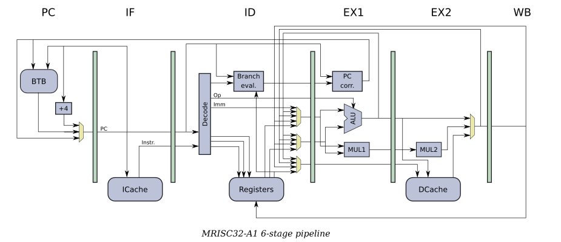

# MRISC32
*Mostly harmless Reduced Instruction Set Computer, 32-bit edition*

This is an experimental, custom 32-bit RISC/Vector CPU.

# Features

* Unified scalar/vector/integer/floating point ISA.
* There are two register files:
  - There are 32 scalar registers, S0-S31, each 32 bits wide.
    - Four registers have special meaning in hardware: Z, PC, LR, VL.
    - 28 registers are general purpose (of which three are reserved: SP, TP, FP).
    - All registers can be used for all types (integers, addresses and floating point).
    - PC is user-visible (for arithmetic and addressing) but read-only (to simplify branching logic).
  - There are 32 vector registers, V0-V31, each with *at least* four 32-bit elements.
    - All registers can be used for all types (integers, addresses and floating point).
* All instructions are 32 bits wide and easy to decode.
  - There are only three basic types of instruction encodings.
  - There is room for 512 register-based and 62 immediate-based instructions.
  - Space has been reserved for future double-word instruction encodings, for an additional 8192 register + 8192 immediate instructions (or more).
* All conditionals are based on register content (not condition code flags).
* There are no condition code flags (carry, overflow, ...).
* Unlike early RISC architectures, there are *no* delay slots.
* Many traditional floating point operations can be handled in whole or patrially by integer operations, reducing the number of necessary instructions:
  - Load/store.
  - Branch.
  - Sign and bit manipulation (e.g. neg, abs).
* Vector operations use a Cray-like model:
  - Vector operations are variable length (1-*N* elements).
  - Most integer and floating point instructions come in both scalar and vector variants.
* In addition to vector operations, there are also packed operations that can improve performance for small data types (byte and half-word).
* There is currently no HW support for 64-bit floating point operations (that is left for a 64-bit version of the ISA).

# Documentation

* [Registers](doc/Registers.md)
* [Instructions](doc/Instructions.md)
* [Vector design](doc/VectorDesign.md)
* [Packed operations](doc/PackedOperations.md)
* [Common constructs](doc/CommonConstructs.md)

# Tools

Currently there is a simple [assembler](asm/) (written in Python) and a [CPU simulator](sim/) (written in C++).

Use the assembler to compile programs, and use the simulator to run them.

# Hardware/HDL

A [VHDL implementation](vhdl/) of a single issue, in-order CPU is currently under development. The working name for the CPU is *MRISC32-A1*:

So far, the following components have been implemented:

* The integer ALU.
  - All single-cycle unpacked integer operations are supported.
* A pipelined (two-cycle) multiply unit.
  - Supports all unpacked integer multiplication operations.
* The scalar register file.
  - There are three read ports and one write port.
* The vector register file.
  - There are two read ports and one write port.
  - Each vector register has four elements.
* A basic 7-stage pipeline.
  - PC and branching logic.
  - Instruction fetch.
  - Decode.
  - Register fetch.
  - Execute.
  - Data read/write logic (scalar and vector).
  - Register write-back.
  - Operand forwarding.

**TODO**: Caches, divide, FPU, packed operations, etc.

# Goals

* Keep things simple - both the ISA and the architecture.
* The ISA should map well to a [classic RISC pipeline](https://en.wikipedia.org/wiki/Classic_RISC_pipeline).
* The ISA should scale from small embedded to larger superscalar implementations.
* The CPU should be easy to implement in an FPGA.
* Create a simple baseline scalar CPU that actually works, and then experiment with optimizations.

## Non-goals

* Don't support multiple word sizes or running modes. If a 64-bit CPU is required, create a new ISA and recompile your software.
* Don't be extensible at the cost of more complicated IF/ID stages.
* Don't be fast and optimal for everything.

