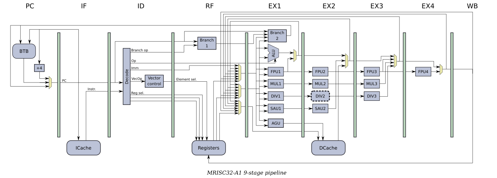

# MRISC32-A1

This is a [VHDL](https://en.wikipedia.org/wiki/VHDL) implementation of a single issue, in-order CPU. The working name for the CPU is *MRISC32-A1*.

## Overview

## Progress

The CPU is still under development. So far, the following components have been implemented:

* A 9-stage pipeline.
  - PC and branching logic.
  - Instruction fetch.
  - Decode.
  - Register fetch.
  - Execute.
  - Data read/write logic (scalar and vector).
  - Register write-back.
  - Operand forwarding.
* The integer ALU.
  - Supports all packed and unpacked integer ALU operations.
  - All ALU operations finish in one cycle.
* A pipelined (three-cycle) integer multiply unit.
  - Supports all packed and unpacked integer multiplication operations.
* A semi-pipelined integer division unit.
  - 15 cycles stall for 32-bit division.
  - 7 cycles stall for 2 x 16-bit division.
  - 3 cycles stall for 4 x 8-bit division.
* A pipelined (two-cycle) Saturating Arithmetic Unit (SAU).
  - Supports all packed and unpacked saturating and halving arithmetic instructions.
* An IEEE 754 compliant(ish) FPU.
  - The following single-cycle FPU instructions are implemented:
    - FMIN, FMAX
    - FSEQ, FSNE, FSLT, FSLE, FSNAN
  - The following three-cycle FPU instructions are implemented:
    - ITOF, UTOF, FTOI, FTOU, FTOIR, FTOUR
  - The following four-cycle FPU instructions are implemented:
    - FADD, FSUB, FMUL
  - Both packed and unpacked FPU operations are implemented.
* The scalar register file.
  - There are three read ports and one write port.
* The vector register file.
  - There are two read ports and one write port.
  - Each vector register has 16 elements.
* An address generation unit (AGU).
  - The AGU supports all [addressing modes](../../doc/AddressingModes.md).
* Branch prediction and correction.
  - The branch misprediction penalty is 3 cycles.

**TODO**: Caches, more FPU instrucions, etc.

## Configurability

The aim is for the MRISC32-A1 to implement the complete MRISC32 ISA, which means that it is a fairly large design (e.g. including an FPU, hardware multiplication and division, etc).

If the design is too large or complex for a certain target chip (FPGA), it is possible to disable many features in the *"Machine configuration"* section of [common/common.vhd](common/common.vhd). E.g. setting `C_CPU_HAS_DIV` to `false` will disable support for hardware division.

It is also possible to change the vector register size by chaging the value of `C_LOG2_VEC_REG_ELEMENTS` (4 means 16 elements, 5 means 32 elements, 8 means 256 elements, and so on).

## Preformance

The MRISC32-A1 can issue **one operation per clock cycle**.

When synthesized against an [Intel Cyclone V FPGA](https://www.intel.com/content/www/us/en/products/programmable/fpga/cyclone-v.html), the maximum running frequency is around **100 MHz**.

