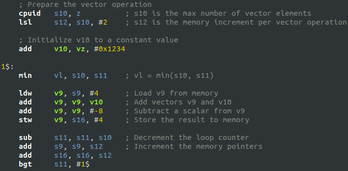

# Tools

## Assembler / Linker

The only way to program the MRISC32 is using [assembly language](https://en.wikipedia.org/wiki/Assembly_language) (high level languages such as C++ via GCC is currently under development.

The primary tool is [GNU binutils](https://www.gnu.org/software/binutils/), which includes an assembler (as) and a linker (ld). A special [MRISC32 port of binutils](https://github.com/mrisc32/binutils-mrisc32) is required to build software for MRISC32.


### Building/installing binutils

Clone the Git repository:

```bash
$ git clone https://github.com/mrisc32/binutils-mrisc32.git
```

Read the [README.md](https://github.com/mrisc32/binutils-mrisc32/blob/users/mbitsnbites/mrisc32/README.md) file for information about how to build and install binutils for MRISC32.


## Building programs

To build assembly language programs that can be used by the simulator or the VHDL testbench (core_tb), do the following:

```bash
$ mrisc32-elf-as -o my-program.o my-program.s
$ mrisc32-elf-ld -o my-program.elf my-program.o
$ tools/elf2bin.py my-program.elf my-program.bin
```

The final `.bin` file can be loaded into the simulator, for instance.


## Simulator

The MRISC32 simulator is a C++ program that can run MRISC32 binaries. See [sim/README.md](sim/README.md).


## Debug trace inspector

Debug traces from the simulator or the VHDL test bench can be inspected using `mrisc32-trace-tool.py`. It can be useful for finding differences between different simulation runs.


## Syntax Highlighting



### gedit / GtkSourceView

Copy or symlink `tools/support/gtksourceview/mr32asm.lang` to `~/.local/share/gtksourceview-3.0/language-specs/`.

For GtkSourceView 4 (e.g. used in gedit in Ubuntu 19.04 and later), copy to `~/.local/share/gtksourceview-4/language-specs/` instead.